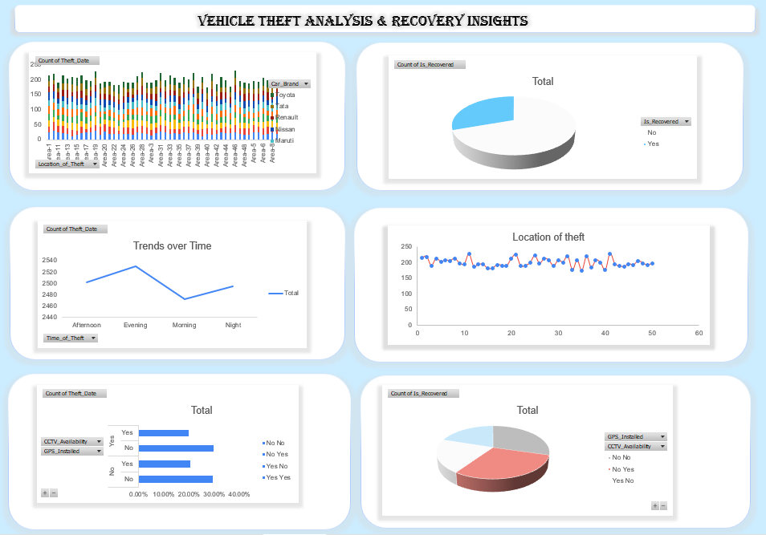

# 🚗 Vehicle Theft Analysis & Recovery Insights (Excel Dashboard)

## 📊 Project Overview
This project presents an interactive Excel dashboard analyzing vehicle theft
patterns and recovery insights in India. The analysis focuses on theft locations,
time trends, vehicle brands, and recovery factors such as GPS installation and
CCTV availability.

The dashboard is built using Excel pivot tables, pivot charts, and slicers.

---

## 📈 Dashboard Preview

---

## 📁 Repository Structure
- `dataset/` – Raw vehicle theft dataset  
- `dashboard/` – Excel dashboard file  
- `images/` – Dashboard screenshots  

---

## 🛠 Tools Used
- Microsoft Excel
- Pivot Tables & Pivot Charts
- Slicers & Filters

---

## ▶️ How to Use
1. Download the files from this repository
2. Open `Vehicle_Theft_Analysis_Dashboard.xlsx`
3. Enable editing if prompted
4. Refresh pivot tables if required

---

## 👤 Author

**Kathir Ranjanaa S**  
📧 Email: kathirranjanaas@gmail.com  
🔗 LinkedIn: https://www.linkedin.com/in/kathir-ranjanaa-s/  
💻 GitHub: https://github.com/Kathirranjanaa  

---

⭐ If you like this project, feel free to star the repository!

